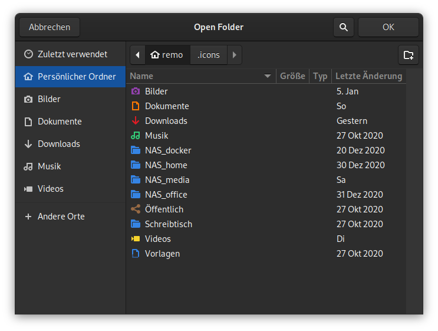

# Nice-Places-Dark
Simple icons to replace the place-icons of Adwaita. Works best with the Adwaita dark theme.
All symbols used are the original [Adwaita symbols](https://gitlab.gnome.org/GNOME/adwaita-icon-theme/-/tree/master/Adwaita).

The basic idea is that only the place icons are replaced and all other icons are inherited from the Adwaita theme. If Adwaita is not installed, the icons are inherited from the `hicolor` theme. The `hicolor` has to be implemented by each OS. So it should also work under Ubuntu.

The colours used are from the GNOME HIG Colors palette by Incscape.

## Install
Open a terminal and clone the repository:
```
mkdir -p ~/.icons
cd ~/.icons
git clone https://github.com/MrReSc/Nice-Places-Dark.git
```
Now open `gnome-tweak-tool` and change the icon theme.

## Screenshot



